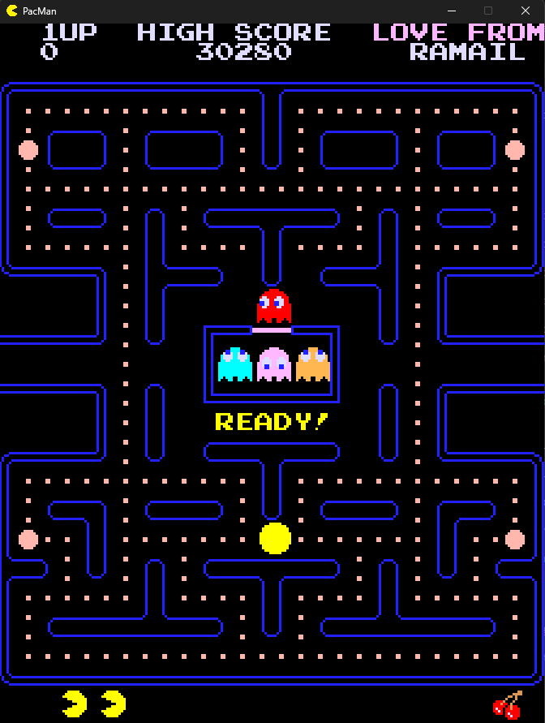
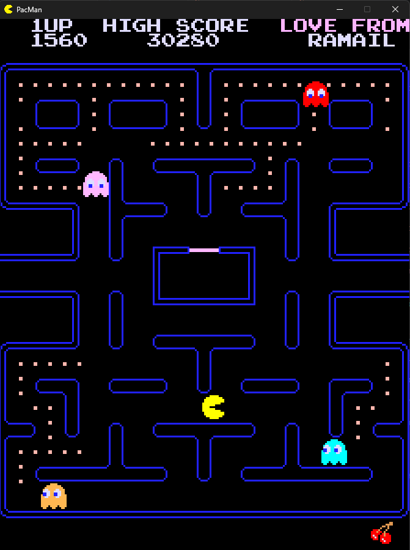
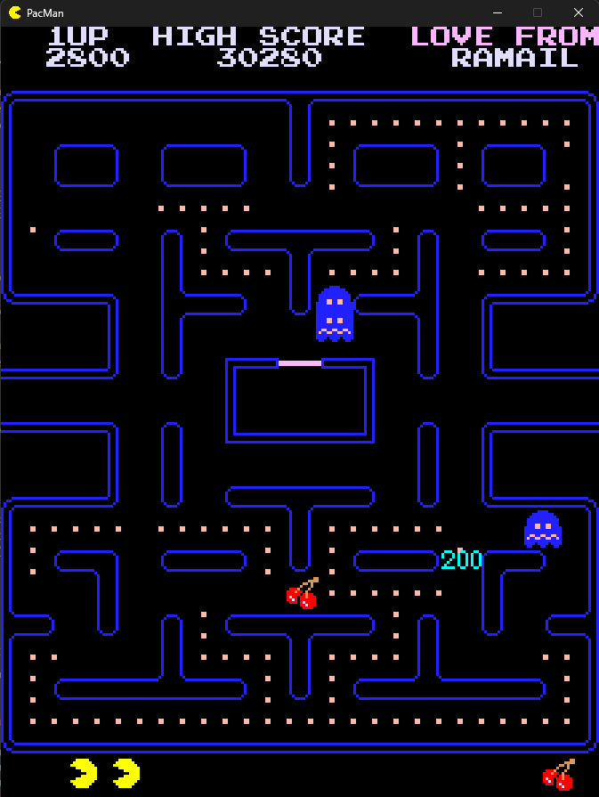

# Pac-Man

Always loved this game, so I wanted to build one from scratch and get it as close to the real arcade version as I could - sprites, sounds, timing, all of it. Not some reskinned clone, really trying to nail the original feel here.

Got most of the groundwork from [The Pac-Man Dossier by Jamey Pittman](https://pacman.holenet.info/) and stuck pretty close to what it lays out. Used minimal AI on this one, wanted to think most of it through myself.

## Screenshots

<table>
  <tr>
    <td></td>
    <td></td>
    <td></td>
  </tr>
</table>

## What's Left

- Intricate ghost house logic (global/local dot counters, mentioned in dossier still needs finishing)
- Small bug fixes, mostly around sound and collision edge cases
- Cleaning up and categorizing the code so it reads better
- Optimization by cutting out redundant rendering and calculations
- More accurate timers and timer settings across levels

## Future Work

- Bring in Ms. Pac-Man since most of the groundwork is already there
- Migrate it over to JavaScript so it can actually be deployed somewhere

## Reference / Assets

- Dossier: https://pacman.holenet.info
- Sprites: https://www.spriters-resource.com/arcade/pacman
- Sounds: https://sounds.spriters-resource.com/arcade/pacman

## Built With
- RayLib (C#)
